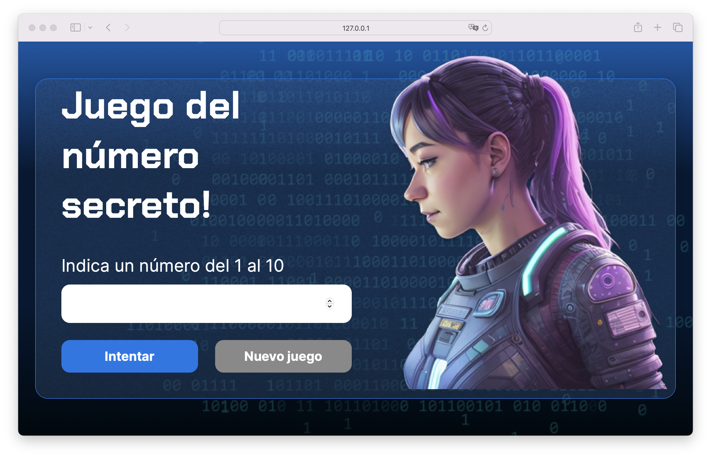
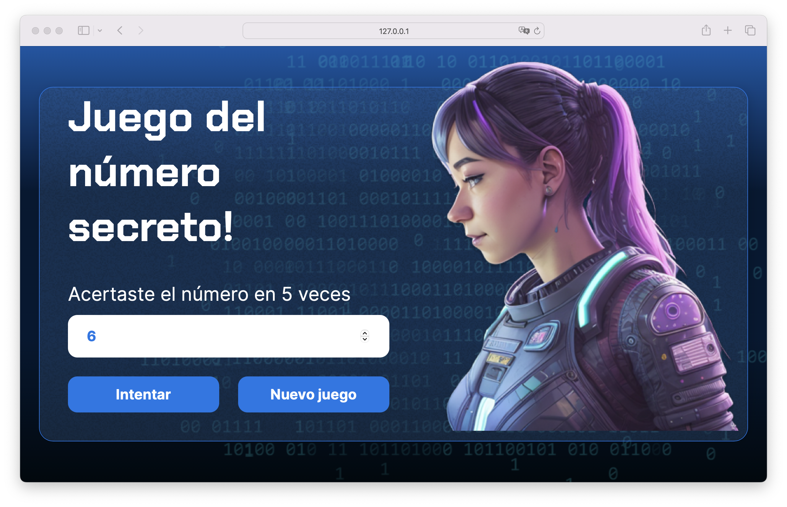

# Number Guesser V2

**Number Guesser** is an upgraded iteration of my previous game, [Number Guesser V1](https://github.com/jorgedoiany/number-guesser-game-v1.git), challenging players to uncover a secret number between 1 and 10. The game features an input field for guesses and includes two buttons: one to submit guesses and another to reset the game upon winning or conceding. Clues are provided to help players determine if their guess is higher or lower than the secret number. It serves as an engaging pastime, enhancing deduction and logic skills, and is well-suited for beginners in programming seeking a practical project, or casual gamers looking for a fun and intellectually stimulating experience in number guessing and mental puzzles.

## Screenshots

## Tech Stack

**Client:** HTML, CSS, JavaScript

## Prerequisites

- **Visual Studio Code (VSCode)**: You can download it from [Visual Studio Code](https://code.visualstudio.com/).

## Installation Steps

### Download the project:

1. Download the project from the repository or directly as a ZIP file.

### Open the project in Visual Studio Code:

1. Unzip the ZIP file (if you downloaded the project as a ZIP).
2. Open Visual Studio Code.
3. Select `File` > `Open Folder` and navigate to the downloaded project folder.

### Run the application:

1. If you're only using HTML, CSS, and JavaScript, simply open the `index.html` file in your preferred web browser.
2. Alternatively, you can use the Live Server extension in VSCode to run the application locally:
   - Install the **Live Server** extension from the VSCode marketplace.
   - Right-click the `index.html` file and select `Open with Live Server`.

That's it! You should now be able to play the **Number Guesser V2** game in your browser.

## Author

- [@jorgedoiany](https://github.com/jorgedoiany)
